# G12_Dividir-e-Conquistar_PA-26.1

**Número da Lista**: 12 
**Conteúdo da Disciplina**: Counting Inversions  

## Alunos
|Matrícula | Aluno |
| -- | -- |
| 23/1037656  |  Arthur Guilherme Aquino Santos |
| 23/1026581  |  Tiago Lemes Teixeira |

## Sobre 

Este projeto implementa um jogo chamado **Movies Match**, cujo objetivo é medir o nível de afinidade entre dois jogadores com base em suas preferências de filmes. O sistema permite que os participantes escolham uma categoria de filmes, como **Ação, Animação, Fantasia, Ficção Científica, Romance ou Suspense**, e em seguida organizem uma lista de sete títulos de acordo com seu gosto pessoal.

Cada jogador define um ranking, atribuindo posições de 1 (filme favorito) a 7 (filme menos preferido). Após os dois participantes concluírem suas classificações, o programa compara as duas listas para identificar o grau de semelhança entre elas.

Para realizar essa comparação, o sistema utiliza um algoritmo de contagem de inversões baseado em Merge Sort. Esse algoritmo verifica quantas posições diferem entre os rankings dos jogadores, permitindo calcular um percentual de afinidade que varia de 0% a 100%.

Ao final, o sistema exibe o resultado da compatibilidade entre os participantes, mostrando a porcentagem de afinidade, a quantidade de inversões encontradas e uma mensagem interpretando o resultado. Quanto menor o número de inversões, maior a semelhança entre os gostos dos jogadores e, consequentemente, maior a afinidade calculada.

## Screenshots

### Tela Inicial

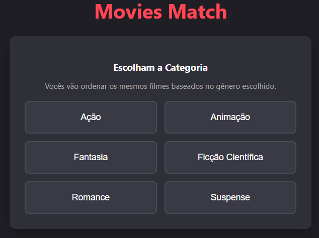

### Filmes de Ação

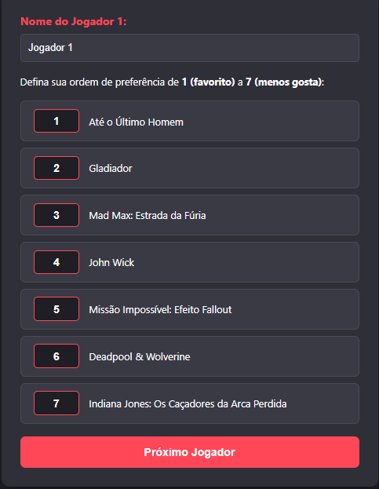

### Filmes de Animação

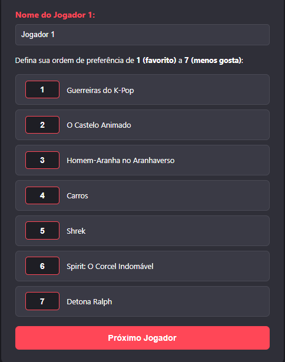

### Filmes de Fantasia

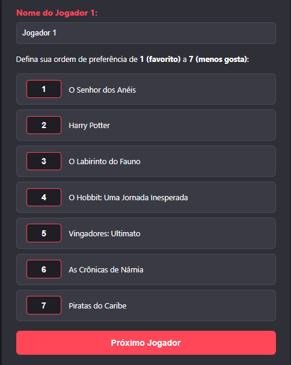

### Filmes de Ficção Científica

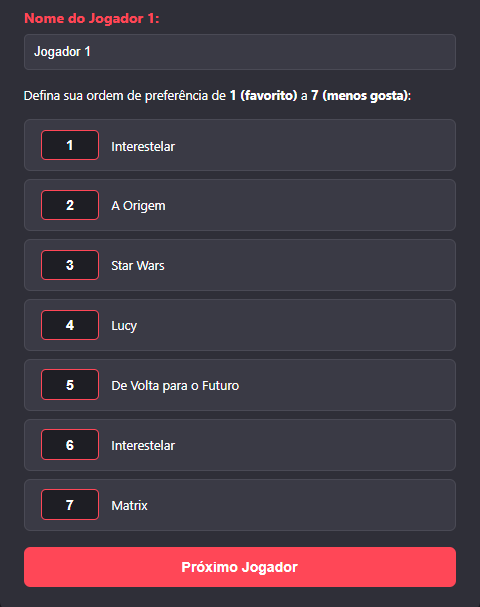

### Filmes de Romance

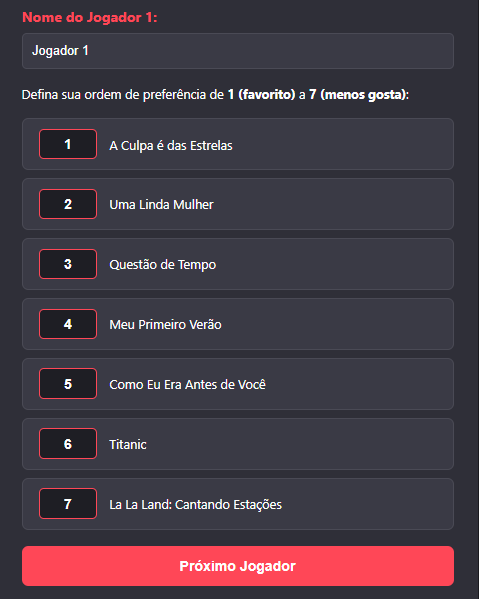

### Filmes de Suspense

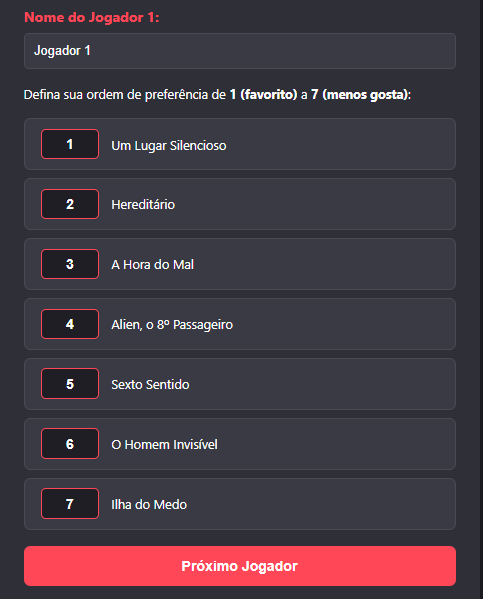

### Resultado de Afinidade de 0%

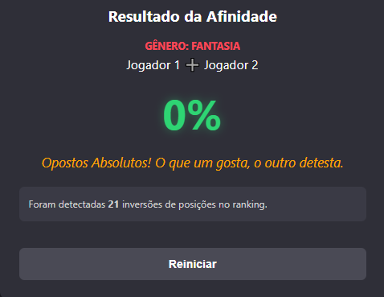

### Resultado de Afinidade maior ou igual a 10%

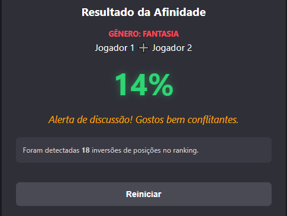

### Resultado de Afinidade maior ou igual a 40%

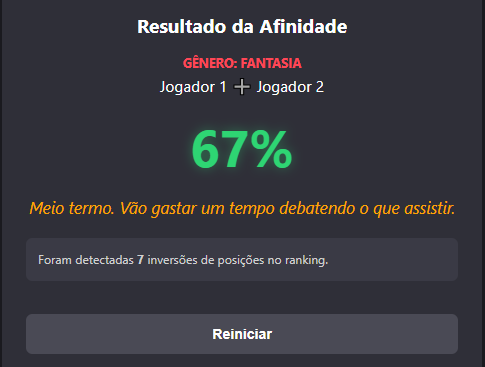

### Resultado de Afinidade maior ou igual a 75%

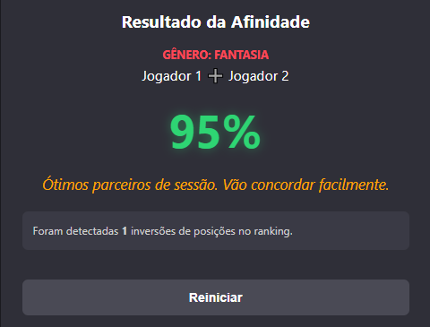

### Resultado de Afinidade de 100%

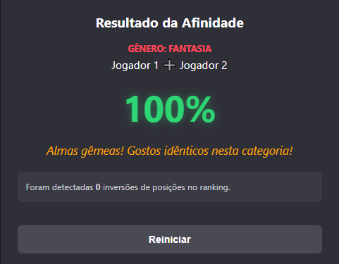

## Instalação

**Linguagem**: HTML + CSS + JavaScript 

## Uso  

Para executar o projeto, basta abrir o arquivo principal `index.html` em qualquer navegador moderno (Chrome, Firefox, Edge, etc).

Não é necessário compilação ou instalação de dependências.

### Execução

- Abra o arquivo `index.html`
- O jogo será carregado automaticamente no navegador

### Funcionamento

Ao iniciar o jogo, será exibida uma interface interativa chamada **Movies Match**, onde o objetivo é medir a afinidade entre dois jogadores com base em suas preferências de filmes.

Os jogadores devem:

- Escolher uma categoria de filmes (Ação, Animação, Fantasia, Ficção Científica, Romance ou Suspense)
- Informar seus nomes
- Organizar os sete filmes da categoria em ordem de preferência
- Definir um ranking de **1 (favorito)** a **7 (menos favorito)**
- Confirmar suas escolhas para calcular a afinidade

Também é possível:

- Alterar a posição dos filmes no ranking
- Visualizar a lista reorganizada em tempo real
- Reiniciar o jogo para escolher uma nova categoria e realizar uma nova comparação

### Regras do Jogo

- Os dois jogadores recebem a mesma lista de filmes da categoria escolhida
- Cada participante deve criar seu próprio ranking de preferência
- O sistema compara os rankings utilizando um algoritmo de contagem de inversões
- Quanto menor o número de inversões encontradas, maior será a afinidade entre os jogadores
- A afinidade é exibida em forma de porcentagem, variando de 0% a 100%

### Feedback do Sistema

- **100% de afinidade** → "Almas gêmeas! Gostos idênticos nesta categoria!"
- **75% a 99%** → "Ótimos parceiros de sessão. Vão concordar facilmente."
- **40% a 74%** → "Meio termo. Vão gastar um tempo debatendo o que assistir."
- **10% a 39%** → "Alerta de discussão! Gostos bem conflitantes."
- **0% a 9%** → "Opostos Absolutos! O que um gosta, o outro detesta."

Ao final da partida, o sistema exibe:

- A porcentagem de afinidade entre os jogadores
- A quantidade de inversões encontradas entre os rankings
- Uma mensagem interpretando o resultado da compatibilidade

## Gravação 

A gravação pode ser acessada através do link .
